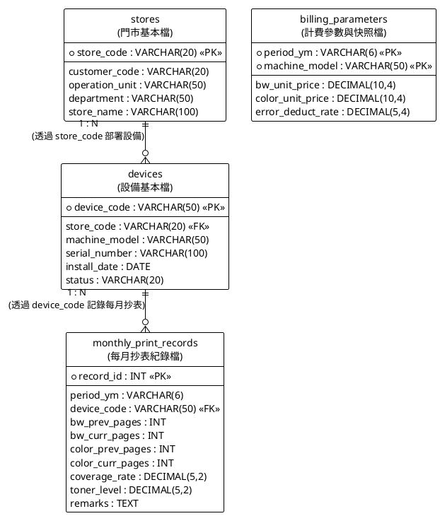

# 抄表資料庫

  抄表資料庫

```plantuml
@startuml
!theme plain
hide circle
skinparam linetype ortho

entity "stores\n(門市基本檔)" as stores {
  * store_code : VARCHAR(20) <<PK>>
  --
  customer_code : VARCHAR(20)
  operation_unit : VARCHAR(50)
  department : VARCHAR(50)
  store_name : VARCHAR(100)
}

entity "devices\n(設備基本檔)" as devices {
  * device_code : VARCHAR(50) <<PK>>
  --
  store_code : VARCHAR(20) <<FK>>
  machine_model : VARCHAR(50)
  serial_number : VARCHAR(100)
  install_date : DATE
  status : VARCHAR(20)
}

entity "monthly_print_records\n(每月抄表紀錄檔)" as monthly_print_records {
  * record_id : INT <<PK>>
  --
  period_ym : VARCHAR(6)
  device_code : VARCHAR(50) <<FK>>
  bw_prev_pages : INT
  bw_curr_pages : INT
  color_prev_pages : INT
  color_curr_pages : INT
  coverage_rate : DECIMAL(5,2)
  toner_level : DECIMAL(5,2)
  remarks : TEXT
}

entity "billing_parameters\n(計費參數與快照檔)" as billing_parameters {
  * period_ym : VARCHAR(6) <<PK>>
  * machine_model : VARCHAR(50) <<PK>>
  --
  bw_unit_price : DECIMAL(10,4)
  color_unit_price : DECIMAL(10,4)
  error_deduct_rate : DECIMAL(5,4)
}

' 關聯性定義
stores ||--o{ devices : "1 : N\n(透過 store_code 部署設備)"
devices ||--o{ monthly_print_records : "1 : N\n(透過 device_code 記錄每月抄表)"

@enduml
```
