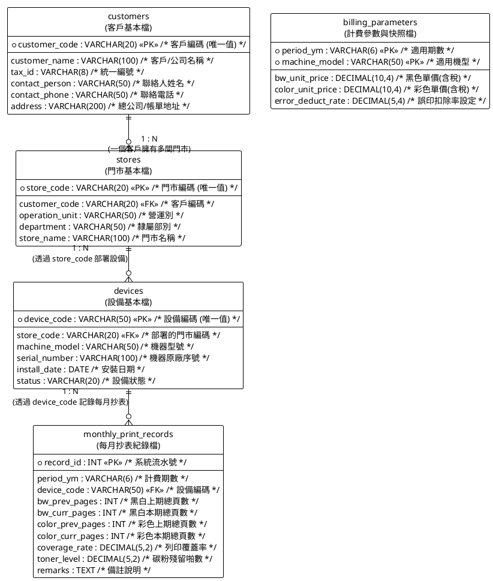

# 抄表資料庫

  抄表資料庫

```plantuml
@startuml
!theme plain
hide circle
skinparam linetype ortho

entity "customers\n(客戶基本檔)" as customers {
  * customer_code : VARCHAR(20) <<PK>> /* 客戶編碼 (唯一值) */
  --
  customer_name : VARCHAR(100) /* 客戶/公司名稱 */
  tax_id : VARCHAR(8) /* 統一編號 */
  contact_person : VARCHAR(50) /* 聯絡人姓名 */
  contact_phone : VARCHAR(50) /* 聯絡電話 */
  address : VARCHAR(200) /* 總公司/帳單地址 */
}

entity "stores\n(門市基本檔)" as stores {
  * store_code : VARCHAR(20) <<PK>> /* 門市編碼 (唯一值) */
  --
  customer_code : VARCHAR(20) <<FK>> /* 客戶編碼 */
  operation_unit : VARCHAR(50) /* 營運別 */
  department : VARCHAR(50) /* 隸屬部別 */
  store_name : VARCHAR(100) /* 門市名稱 */
}

entity "devices\n(設備基本檔)" as devices {
  * device_code : VARCHAR(50) <<PK>> /* 設備編碼 (唯一值) */
  --
  store_code : VARCHAR(20) <<FK>> /* 部署的門市編碼 */
  machine_model : VARCHAR(50) /* 機器型號 */
  serial_number : VARCHAR(100) /* 機器原廠序號 */
  install_date : DATE /* 安裝日期 */
  status : VARCHAR(20) /* 設備狀態 */
}

entity "monthly_print_records\n(每月抄表紀錄檔)" as monthly_print_records {
  * record_id : INT <<PK>> /* 系統流水號 */
  --
  period_ym : VARCHAR(6) /* 計費期數 */
  device_code : VARCHAR(50) <<FK>> /* 設備編碼 */
  bw_prev_pages : INT /* 黑白上期總頁數 */
  bw_curr_pages : INT /* 黑白本期總頁數 */
  color_prev_pages : INT /* 彩色上期總頁數 */
  color_curr_pages : INT /* 彩色本期總頁數 */
  coverage_rate : DECIMAL(5,2) /* 列印覆蓋率 */
  toner_level : DECIMAL(5,2) /* 碳粉殘留啪數 */
  remarks : TEXT /* 備註說明 */
}

entity "billing_parameters\n(計費參數與快照檔)" as billing_parameters {
  * period_ym : VARCHAR(6) <<PK>> /* 適用期數 */
  * machine_model : VARCHAR(50) <<PK>> /* 適用機型 */
  --
  bw_unit_price : DECIMAL(10,4) /* 黑色單價(含稅) */
  color_unit_price : DECIMAL(10,4) /* 彩色單價(含稅) */
  error_deduct_rate : DECIMAL(5,4) /* 誤印扣除率設定 */
}

' 關聯性定義
customers ||--o{ stores : "1 : N\n(一個客戶擁有多間門市)"
stores ||--o{ devices : "1 : N\n(透過 store_code 部署設備)"
devices ||--o{ monthly_print_records : "1 : N\n(透過 device_code 記錄每月抄表)"

@enduml
```
