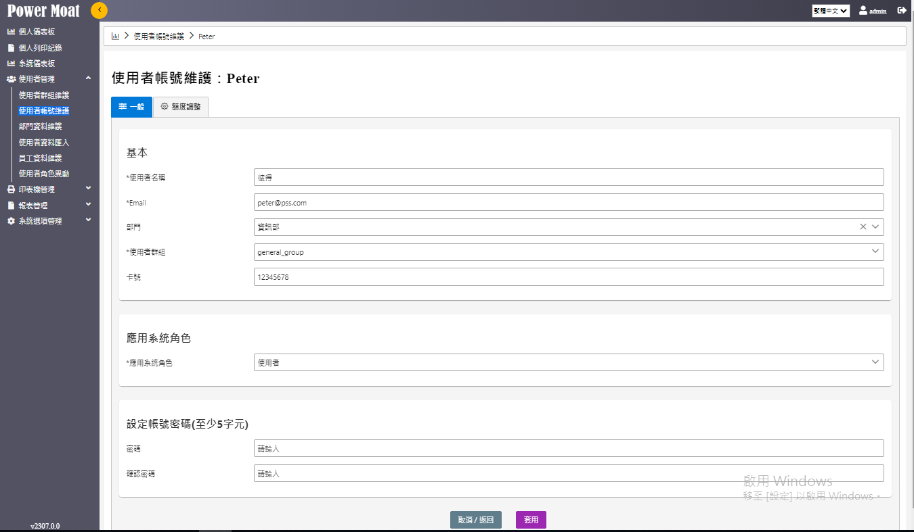
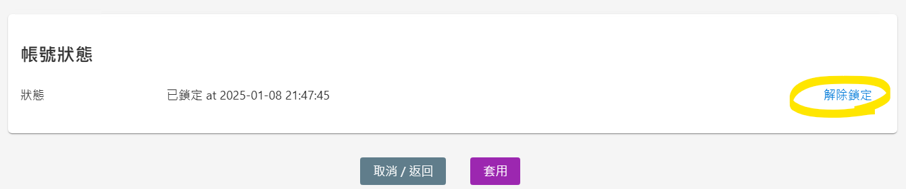
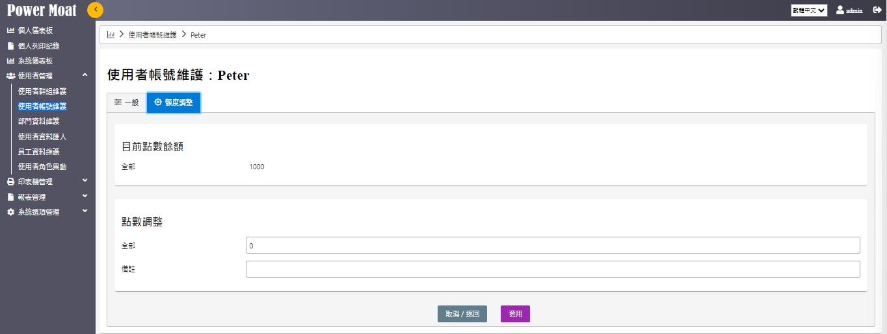

# 使用者帳號維護

  #@img_U0001/image54.png

新增、編輯、刪除使用者資料

## [新增]：建立一個新的使用者帳號 Peter

  #@img_U0001/image55.png

## [注意事項]

**Email欄位必須符合 <xxxx@xxx.xxx> 格式，必須有 "@"**

**印表機認證時，會檢核Email欄位**

## 點選"編輯"符號 > 進入編輯 [一般]

{width="6.471838363954506in" height="3.772661854768154in"}

{width="5.768055555555556in" height="1.2083333333333333in"}

當帳號因登入錯誤次數過多導致被鎖定，可以於使用者詳細頁手動進行解除鎖定狀態。

## 點選"編輯"符號 > 進入編輯 [額度調整]

{width="6.471527777777778in" height="2.4436723534558182in"}
