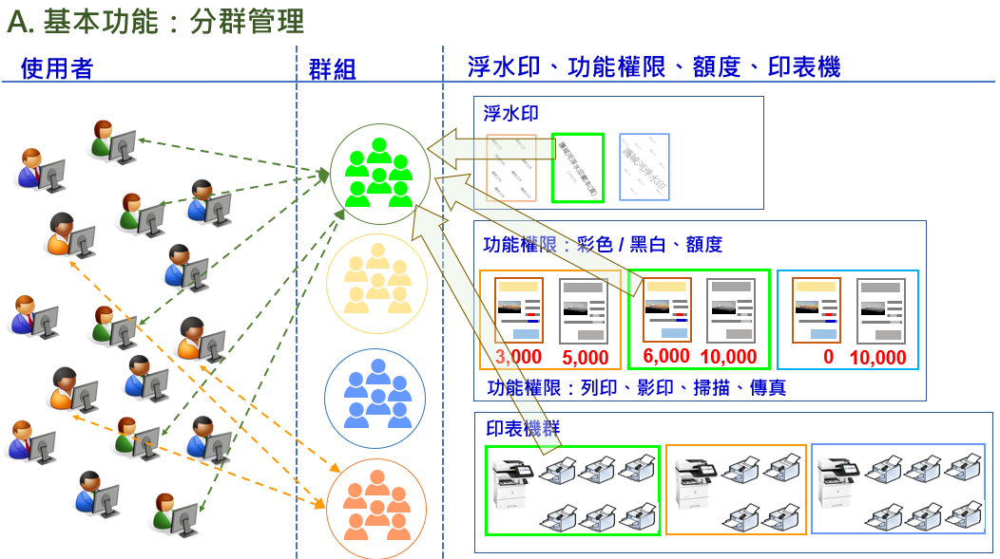

# 使用者群組觀念說明

{width="5.768055555555556in" height="3.229530839895013in"}

## 使用者群組管理項目

- 印表機功能使用權限：**[列印功能權限維護]**

> 列印、影印、掃描、傳真 + 黑白/彩色

- 額度控管：**[額度角色維護]**

- 可使用的印表機：**[印表機群組維護]**

- 浮水印：**[安全-浮水印]**

## 使用者群組建立前置作業

- 建立列印權限角色

- 建立額度角色

- 建立印表機群組

- 建立浮水印
