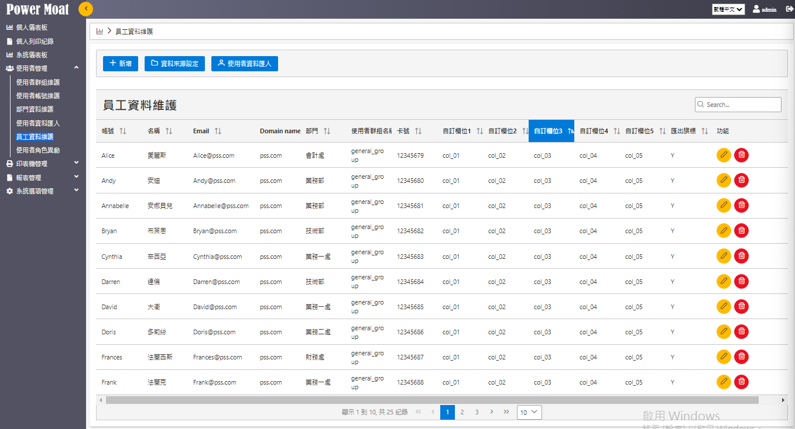
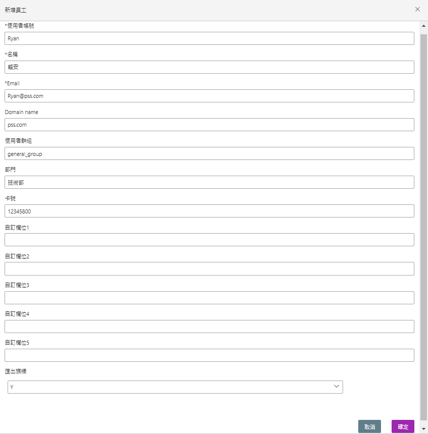
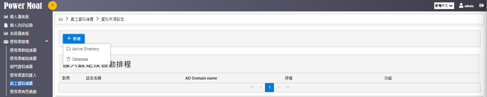
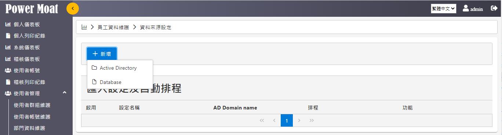
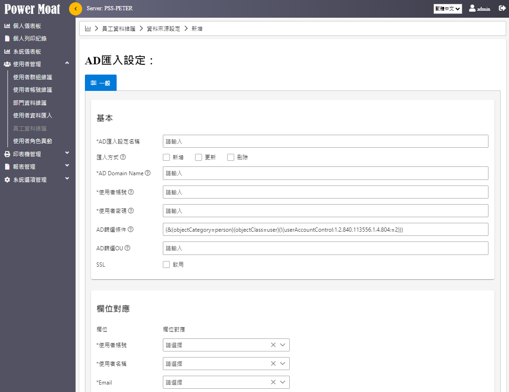
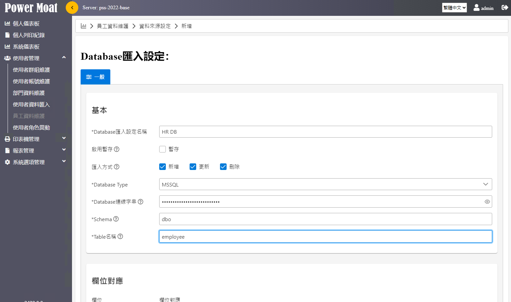

# 員工資料維護

**功能說明：員工資料有 3項功能**

- **員工資料維護：新增/修改/刪除**

- **員工資料匯入：匯入來源 AD、Database，設定排程作業**

{width="5.776416229221347in" height="3.1222222222222222in"}

## 員工資料維護：新增/修改/刪除

**[新增]：建立一筆新的員工資料：Ryan 賴安**

{width="5.111798993875766in" height="5.1904341644794405in"}

**點選"編輯"符號 > 進入編輯**

{width="5.746231408573928in" height="3.088888888888889in"}

## [資料來源設定] -- [新增]：建立一筆新的AD 匯入員工資料的設定資料

{width="5.745833333333334in" height="1.1491666666666667in"}

## 員工資料匯入：設定匯入來源、排程作業

**[新增]：員工資料檔匯入方式 -- 有2種匯入方式**

- **Active Directory**

- **Database**

{width="5.745833333333334in" height="1.5536701662292214in"}

> **.**

### Active Directory：新增設定一筆由 AD 匯入員工資料檔的排程

- **[基本]：設定AD相關資料**

- **[欄位對應]：設定AD對應員工資料檔欄位**

- **[排程]：設定匯入的週期時間**

{width="5.768055555555556in" height="4.445833333333334in"}

### Database：由 DB 匯入員工資料檔 (須依客戶端環境進行客製化)

{width="5.768055555555556in" height="3.411111111111111in"}

- **[基本]：設定DB相關資料**

- **[欄位對應]：設定DB對應員工資料檔欄位**

- **[排程]：設定匯入的週期時間**
