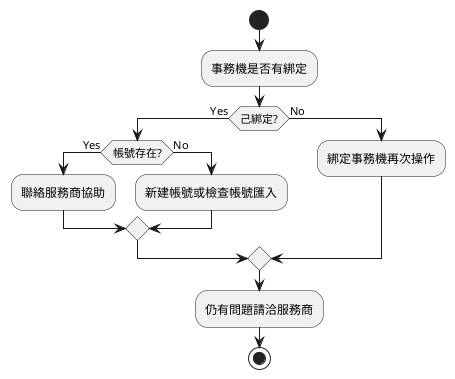

# 事務機登錄失敗

  檢查使用者事務機登錄功能

```plantuml
@startuml
start
:事務機是否有綁定;
/' 檢查使用者帳號 '/
if (己綁定?) then (Yes)
    if (帳號存在?) then (Yes)
        :聯絡服務商協助;
    else (No)
        :新建帳號或檢查帳號匯入;
    endif 
else (No)
  :綁定事務機再次操作;
endif
  :仍有問題請洽服務商;

stop
@enduml
```
