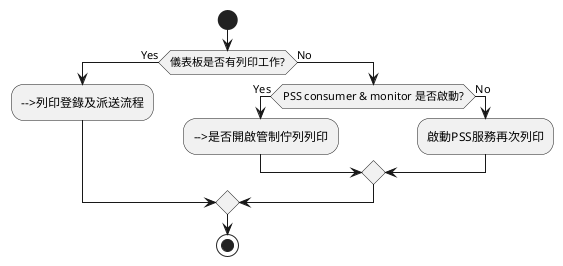
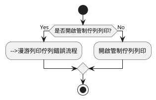
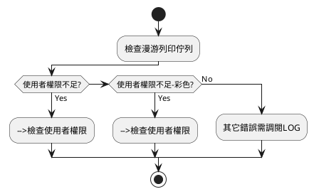
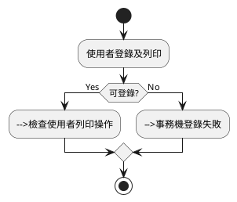
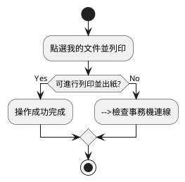
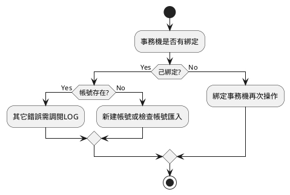
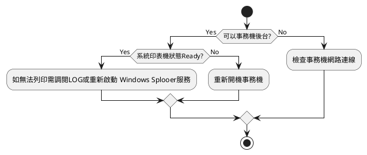

# 列印失敗

## 列印文件未出現在儀表板
　　
　　確認使用者送出列印後,工作是否出現在列印文件儀表板
　　

## 是否開啟管制佇列列印
　　
　　檢查[印表機管理維護]漫游列印印表機設定

## 漫游列印佇列錯誤流程
　　
　　檢查為何漫游列印工作法顯示在漫游佇列中

## 列印登錄及派送流程
　　
    檢查為何漫游列印工作無法派送至印表機

## 檢查使用者列印操作

 檢查送出列印進行列印工作反應

## 事務機登錄失敗

 檢查使用者事務機登錄功能

## 　檢查事務機連線

 檢查事務機設備是否在線

