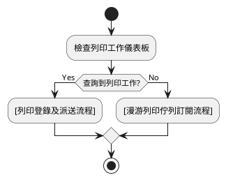
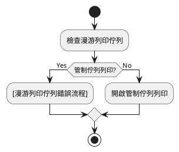
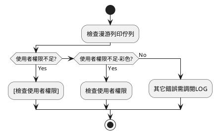

# 列印失敗

## 列印文件未出現在儀表板
　　
　　確認使用者送出列印後,工作是否出現在列印文件儀表板
　　

```plantuml
@startuml
start
:檢查列印工作儀表板;

if (查詢到列印工作?) then (Yes)
  :[列印登錄及派送流程];
else (No)
  :[漫游列印佇列訂閱流程];
endif

stop
@enduml
```

## 漫游列印佇列訂閱流程
　　
　　檢查[印表機管理維護]漫游列印印表機設定

```plantuml
@startuml
start
:檢查漫游列印佇列;

if (管制佇列列印?) then (Yes)
  :[漫游列印佇列錯誤流程];
else (No)
  :開啟管制佇列列印;
endif

stop
@enduml
```

## 漫游列印佇列錯誤流程
　　
　　檢查為何漫游列印工作法顯示在漫游佇列中

```plantuml
@startuml
start
:檢查漫游列印佇列;

if (使用者權限不足?) then (Yes)
  :[檢查使用者權限];
elseif (使用者權限不足-彩色?) then (Yes)
  :檢查使用者權限;
else (No)
  :其它錯誤需調閱LOG;
endif

stop
@enduml
```

## 列印登錄及派送流程
　　
　　檢查為何漫游列印工作無法派送至印表機

```plantuml
@startuml
start
:檢查漫游列印佇列;

if (使用者權限不足?) then (Yes)
  :[檢查使用者權限];
elseif (使用者權限不足-彩色?) then (Yes)
  :檢查使用者權限;
else (No)
  :其它錯誤需調閱LOG;
endif

stop
@enduml
```
