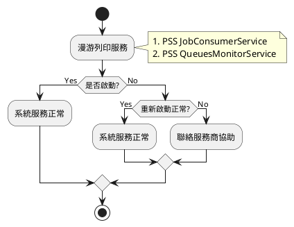
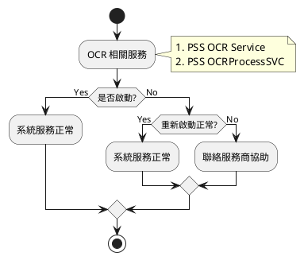

# 漫游列印服務

  漫游列印相關服務

```plantuml
@startuml
start
:漫游列印服務;

note right
1. PSS JobConsumerService
2. PSS QueuesMonitorService
end note

if (是否啟動?) then (Yes)
  :系統服務正常;
else (No)
  if (重新啟動正常?) then (Yes)
        :系統服務正常;
    else (No)
        :聯絡服務商協助;
  endif
endif


stop
@enduml
```

## OCR 相關服務確認

  OCR 相關服務

```plantuml
@startuml
start
:OCR 相關服務;

note right
1. PSS OCR Service
2. PSS OCRProcessSVC
end note

if (是否啟動?) then (Yes)
  :系統服務正常;
else (No)
  if (重新啟動正常?) then (Yes)
        :系統服務正常;
    else (No)
        :聯絡服務商協助;
  endif
endif

stop
@enduml
```
