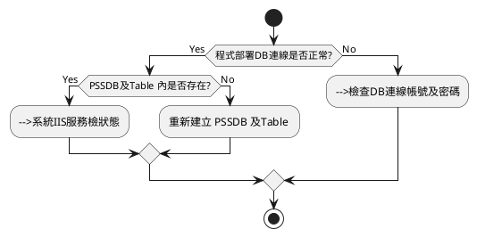
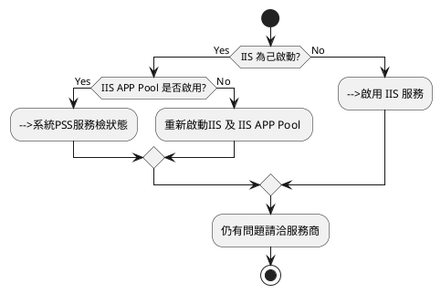
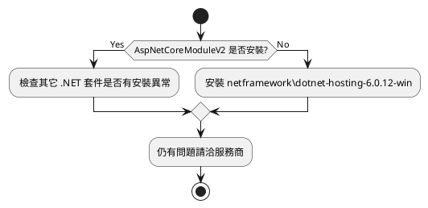

# 網頁無法顯示

## 資料庫是否存在

  確認SQL SERVER 及資料庫是否存在

## 系統IIS服務檢狀態

  系統IIS服務檢狀態

## .Net 套件是否安裝

執行 verify-pss_system.ps1

## 排除異常操作說明

### 建立 PSSDB 及Table
  
  以下操作只限定於沒有 PSSDB 的情況下

- 開啟安裝ISO 目錄 MsSQL\ Database
- 使用SSMS 分別操作 pss_mssql_ddl.sql, pss_mssql_trigger.sql
