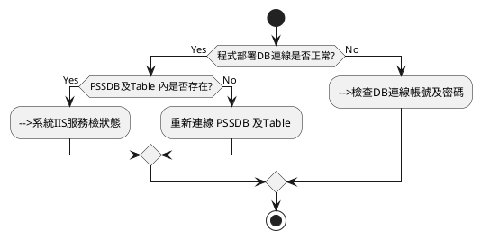
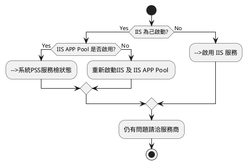

# 網頁無法顯示

## 資料庫是否存在

  確認SQL SERVER 及資料庫是否存在

```plantuml
@startuml
start
if (程式部署DB連線是否正常?) then (Yes)
    if (PSSDB及Table 內是否存在?) then (Yes)
        :-->系統IIS服務檢狀態;
    else (No)
        :重新連線 PSSDB 及Table ;
    endif
else (No)
   :-->檢查DB連線帳號及密碼;
endif

stop
@enduml
```

## 系統IIS服務檢狀態

  系統IIS服務檢狀態

```plantuml
@startuml
start
if (IIS 為己啟動?) then (Yes)
    if (IIS APP Pool 是否啟用?) then (Yes)
        :-->系統PSS服務檢狀態;
    else (No)
        :重新啟動IIS 及 IIS APP Pool ;
    endif
else (No)
   :-->啟用 IIS 服務;
endif
  :仍有問題請洽服務商;
stop
@enduml
```
