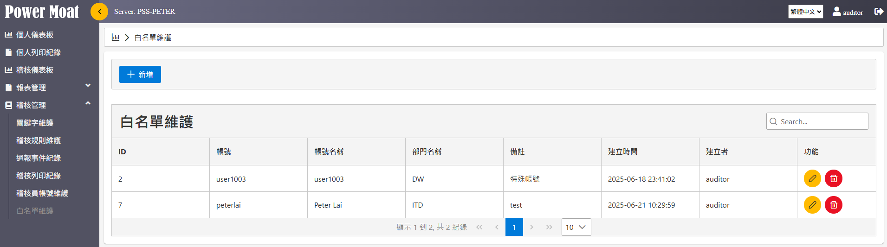
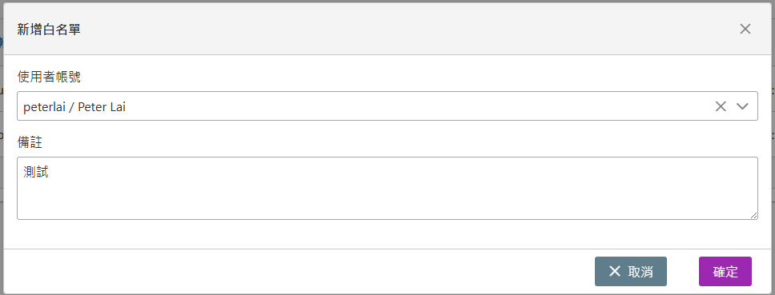

# 白名單維護

{width="5.768055555555556in" height="1.6090277777777777in"}

稽核管理員可依據需求設定白名單，白名單的帳號將不進行四工備存作業。

## [新增]：賦予一個帳號具備白名單

例：將 peterlai 賦予白名單

{width="5.768055555555556in" height="2.198611111111111in"}
