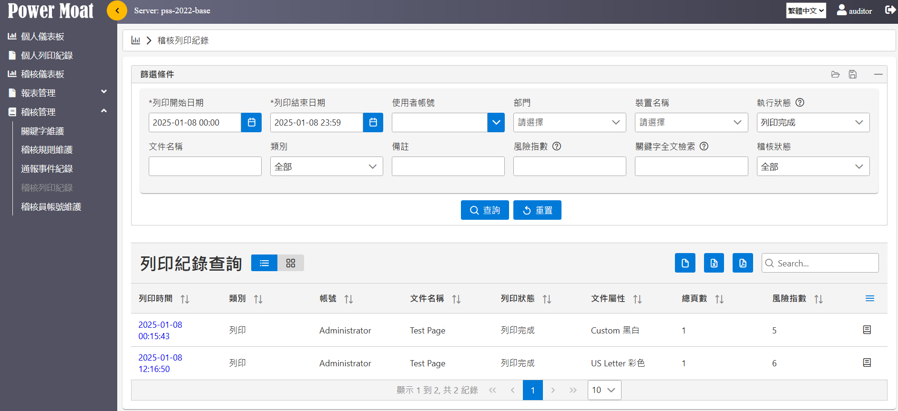
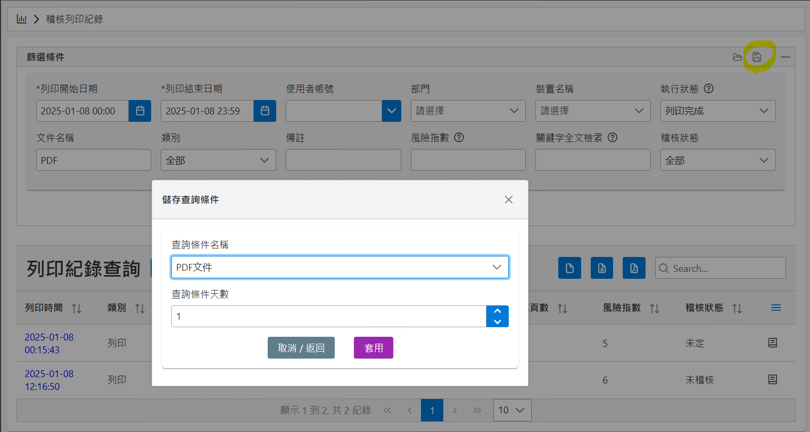
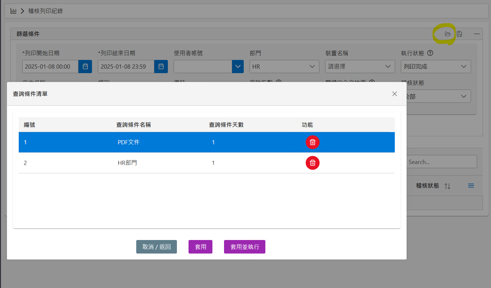
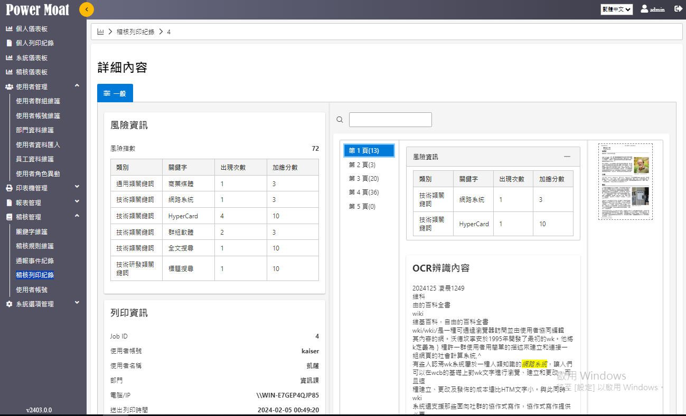
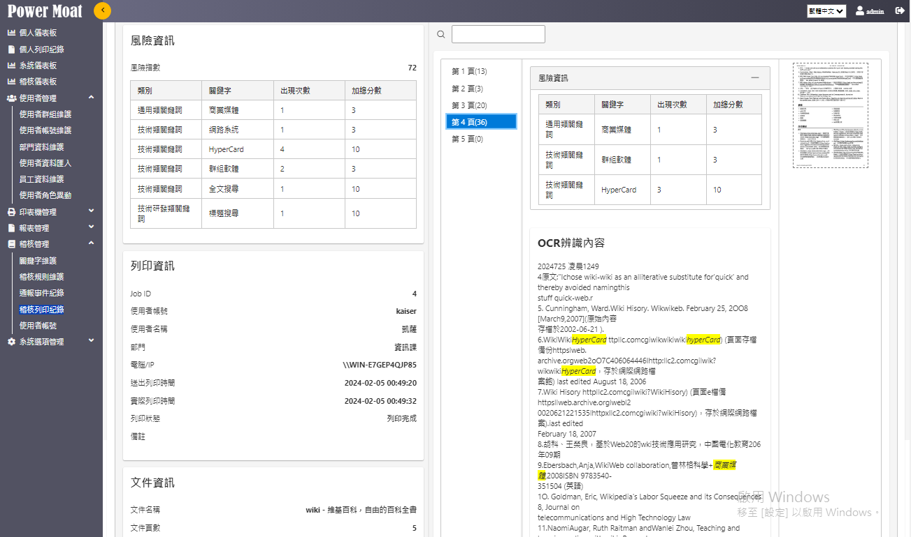
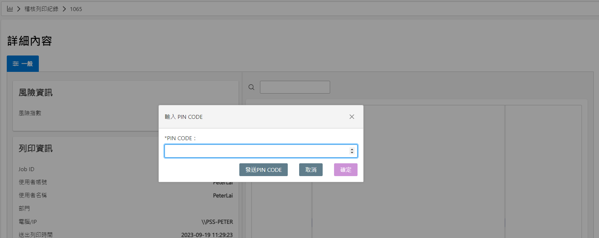
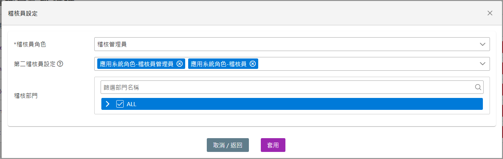
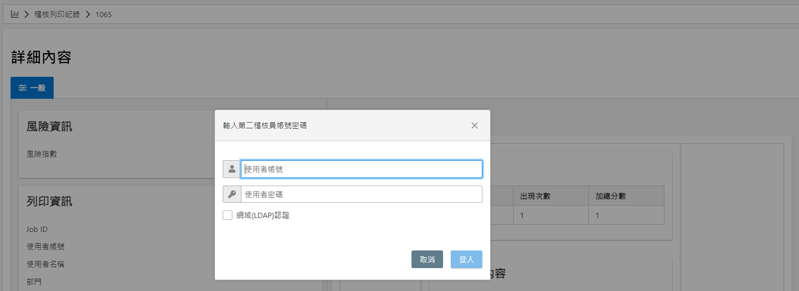

# 稽核列印紀錄

{width="5.768055555555556in" height="2.645138888888889in"}

-   查詢條件：

    -   列印開始日期及結束日期：指定查詢的日期區間

    -   使用者帳號：指定某一個使用者的紀錄

    -   部門：指定某一個部門的紀錄

    -   裝置名稱：指定某一台裝置的紀錄

    -   執行狀態：指定列印作業的執行狀態(預設為：列印完成)

    -   備註：指定備註的文字

    -   風險指數：指定風險指數必須超過此分數

    -   關鍵字全文檢索：文件OCR內容包含指定的關鍵字

**\
**

**篩選條件儲存**

{width="5.768055555555556in" height="3.0770833333333334in"}

查詢條件名稱相同則覆蓋舊有的條件。

**篩選條件載入**

{width="5.768055555555556in" height="3.390277777777778in"}

選擇條件項目後，可套用帶入套用篩選條件 或 套用並執行。

**\
**

稽核調閱列印詳細紀錄

{width="5.738888888888889in" height="3.485774278215223in"}

-   風險資訊：顯示此份文件加總的風險指數

-   列印資訊：顯示此份文件的相關資訊

-   右方為影像及OCR內容顯示區塊

    -   上方搜尋框可以輸入搜尋字串，若符合時將於頁碼前顯示 "\*"

    -   風險資訊區塊顯示符合關鍵字比對的結果

    -   OCR辨識內容顯示此影像的文字內容，若符合關鍵字將以高亮度區塊顯示

    -   影像檔縮圖點擊後即可顯示大圖檢視。

{width="5.736887576552931in" height="3.390277777777778in"}

調閱影像安全模式(PINCODE)

{width="5.7444444444444445in" height="2.2849343832020996in"}

若啟用時，調閱影像時需要輸入 PIN CODE(系統會寄送至Email信箱)後才能進行影像檢視。

調閱影像安全模式(雙認證)

{width="5.768055555555556in" height="1.8243055555555556in"}

當啟用雙認證模式時，須為每位稽核者指定第二稽核員。

第二稽核員可以是指定的應用系統角色(可以多個) 或是 指定的帳號(可以多個)

{width="5.7444444444444445in" height="2.100515091863517in"}

調閱影像時，須登入指定的第二稽核員後方可調閱影像。
