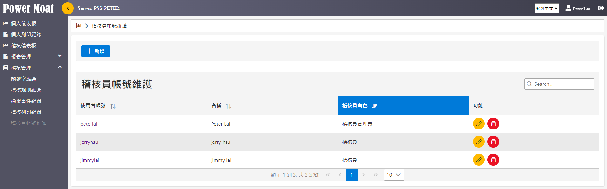
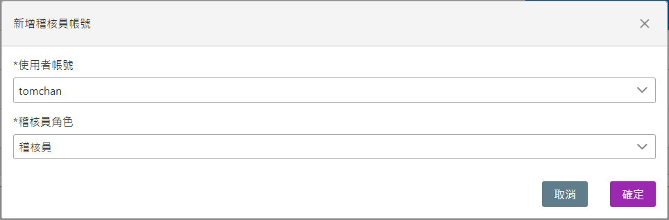
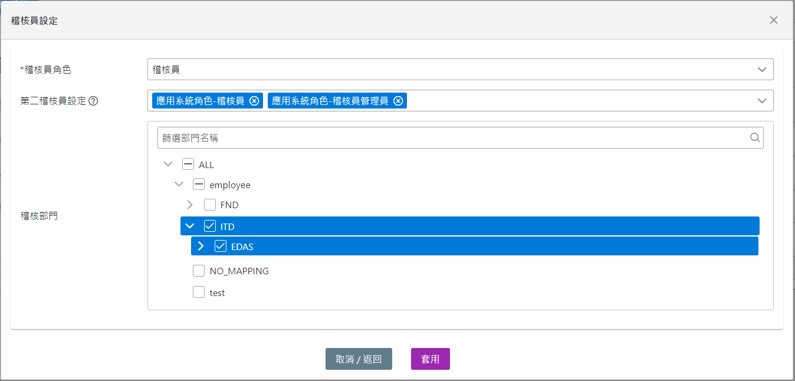

# 稽核員帳號維護

**稽核員帳號維護。**

{width="5.768055555555556in" height="1.8020833333333333in"}

稽核管理員可依需求賦予稽核員的角色

## [新增]：賦予一個帳號具備稽核員角色

例：將 tomchan 賦予稽核員角色

{width="5.768055555555556in" height="1.9027777777777777in"}

## 修改其相關設定(ex: 稽核部門範圍)

{width="5.768055555555556in" height="2.763888888888889in"}
