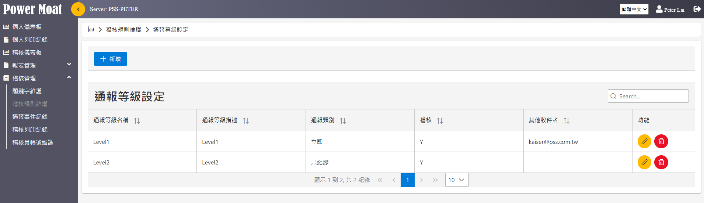
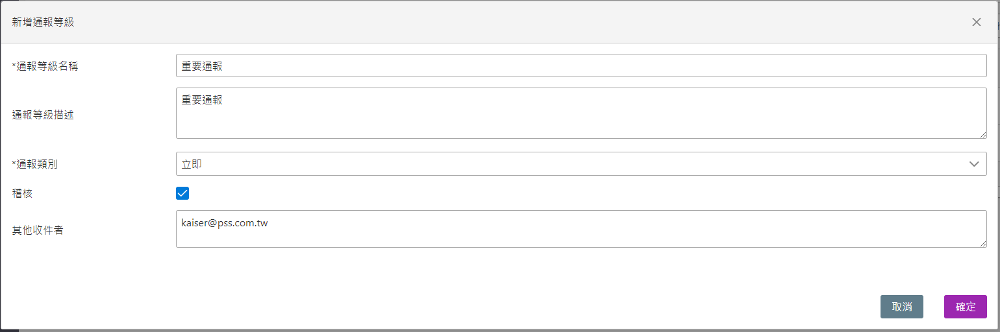
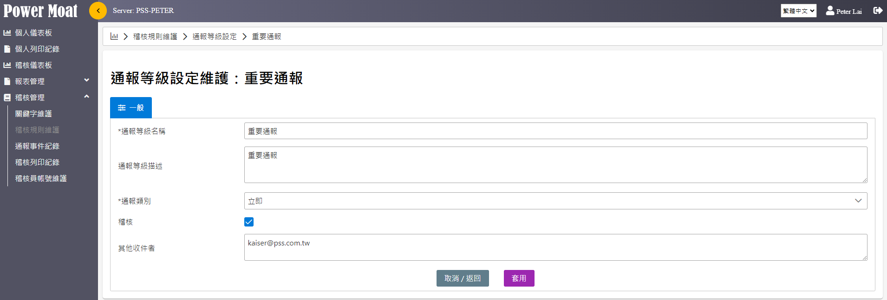
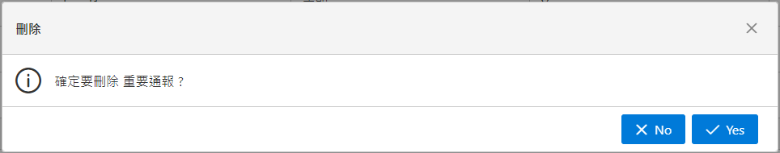
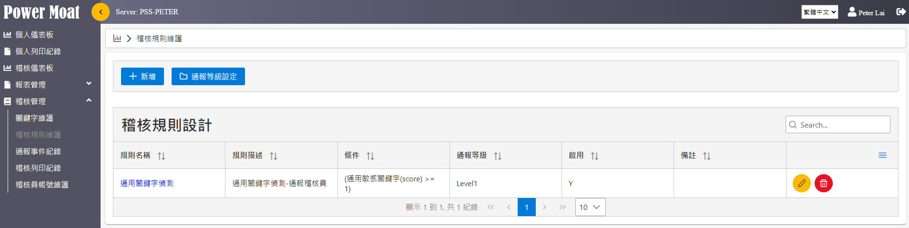
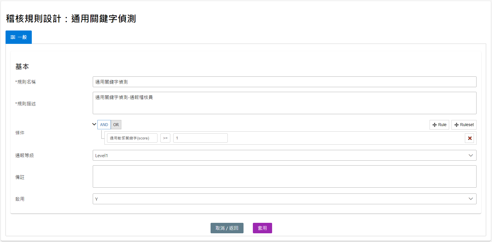
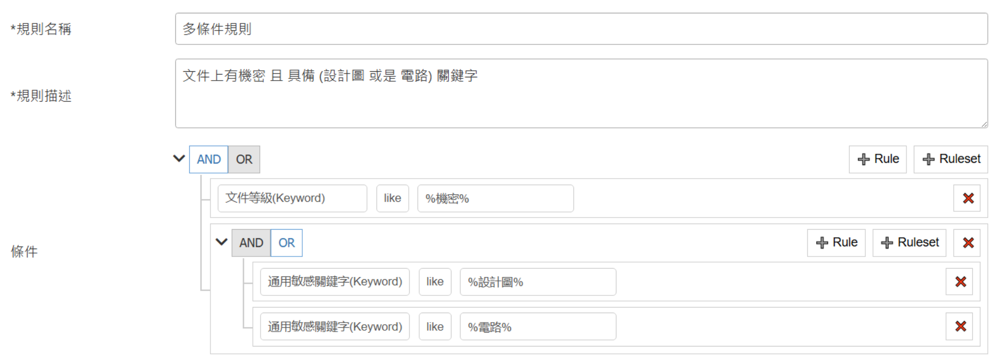

# 稽核規則維護

**通報等級設定與稽核規則設計**

{width="5.768055555555556in" height="1.6701388888888888in"}

**通報等級設定：設定各種不同的通報等級**

**新增通報等級 (通報類別：立即、批次、只紀錄)**

{width="5.768055555555556in" height="1.917361111111111in"}

**通報等級設定：修改。點擊\[編輯圖示\] 即可進入編輯修改**

{width="5.768055555555556in" height="1.9597222222222221in"}

**\
**

**通報等級設定：刪除。點擊\[刪除圖示\] 即可刪除。**

{width="5.768055555555556in" height="1.1368055555555556in"}

**稽核規則設計：依據關鍵字的設定加以組合規則，以制定通報等級**

{width="5.768055555555556in" height="1.448611111111111in"}

**稽核規則設計：可進行新增、修改、刪除。**

{width="5.768055555555556in" height="2.847916666666667in"}

條件: 依照需求設定偵測條件 (ex: 通用關鍵字(score) \>= 1)

通報等級: 當符合上述條件時，需執行哪個通報等級。

多條件規則設定範例

{width="5.768055555555556in" height="2.0840277777777776in"}

當文件內容有 "機密" 且 (文件內容 有 "設計圖" 或是 "電路") 則條件成立，將觸發通報事件。
