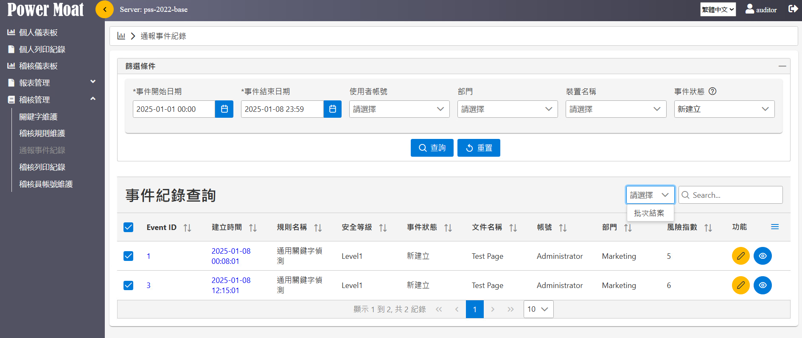
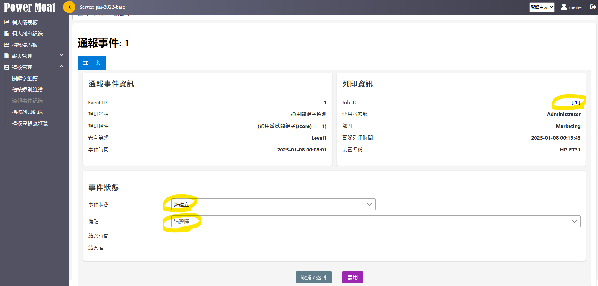

# 通報事件紀錄

達到通報等級的列印Job 進入通報事件紀錄，簡易的案件管理。

{width="5.768055555555556in" height="2.435416666666667in"}

篩選條件: 可依照事件時間、使用者帳號、部門、裝置及事件狀態來查詢。

事件紀錄清單可點選 {width="0.17187445319335082in" height="0.16829286964129483in"} 查看事件詳細資料。

事件紀錄清單可點選 {width="0.1510411198600175in" height="0.1707425634295713in"} 查看列印文件的詳細資料。

可以多筆選取後進行批次結案作業。

{width="5.768055555555556in" height="2.7680555555555557in"}

通報事件詳細頁面

右上方 Job ID \[1\] 連結，可以快速連結到列印文件詳細頁進行調閱。

事件狀態預設為 \[新建立\]，稽核員可進行審核並輸入備註意見後進行結案。
