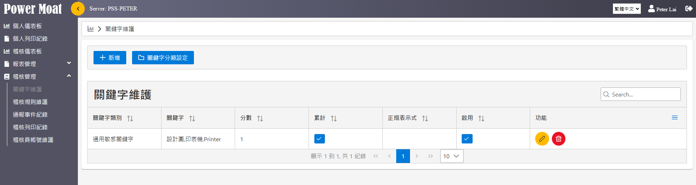
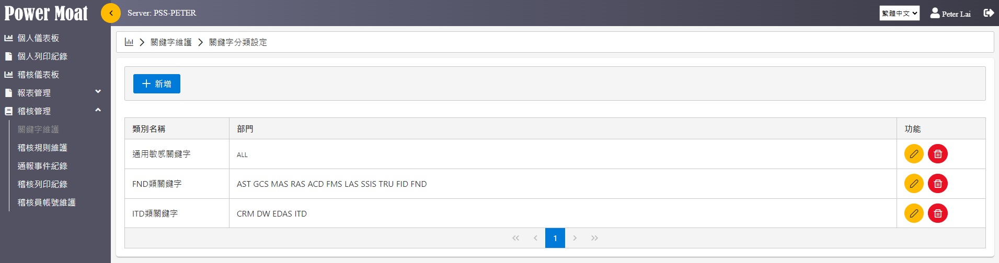
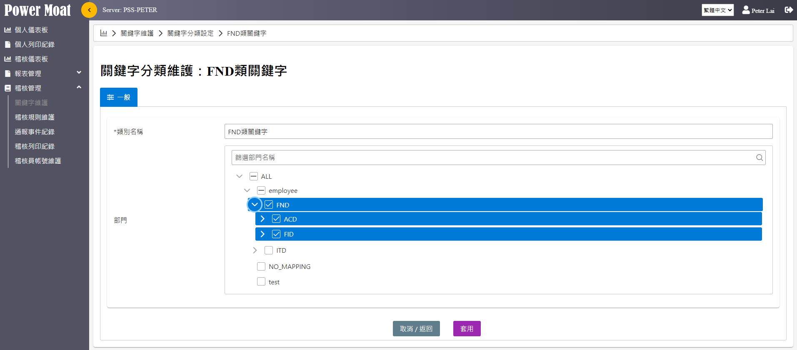
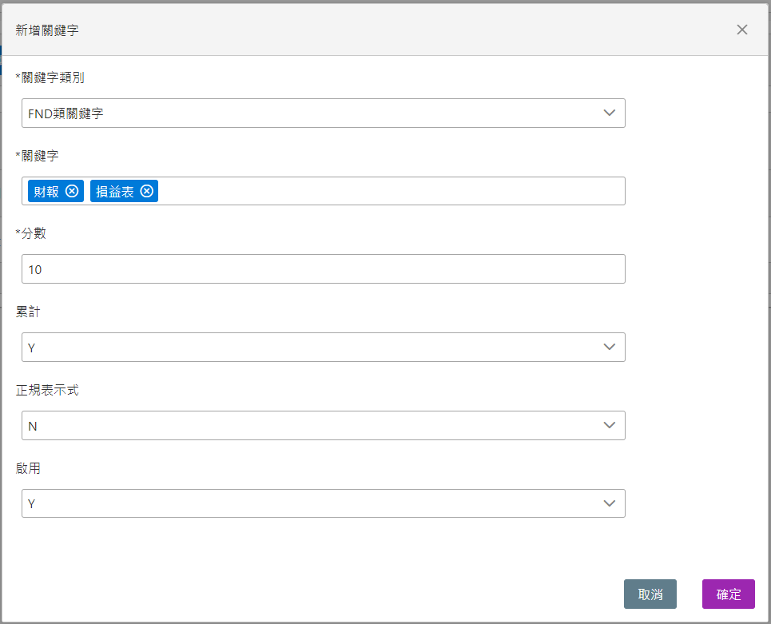
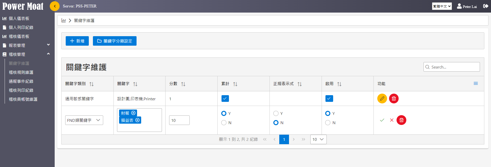

# 關鍵字維護

**關鍵字分類設定、新增關鍵字**

{width="5.768055555555556in" height="1.54375in"}

**關鍵字分類設定：可依據不同分類設定關鍵字、與部門進行檢核。**

{width="5.768055555555556in" height="1.5215277777777778in"}

**關鍵字分類修改維護 \[編輯圖示\]**

{width="5.768055555555556in" height="2.5388888888888888in"}

**新增關鍵字：關鍵字分類下可設定不同關鍵字、分數、計數規則。**

> {width="4.597625765529309in" height="3.720833333333333in"}

**累計: 若設定為Y，表示風險分數 = 關鍵字出現次數N \* 分數**

**正規表示式: 若設定為 Y，表示關鍵字以正規表示式來偵測，以下為兩個案例:**

**身分證號: \[A-Z\]\[12\]\\d{8} **

**手機門號: 09\\d{8}**

**修改關鍵字：選擇要修改的關鍵字，點擊 \[編輯圖示\]** **直接進行編輯。**

{width="5.768055555555556in" height="1.9625in"}
