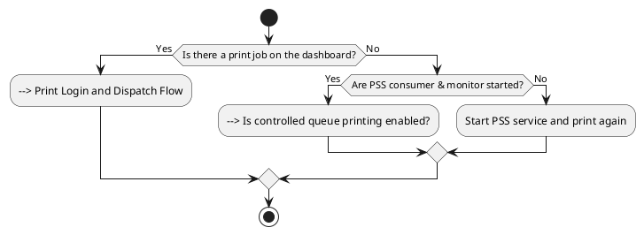
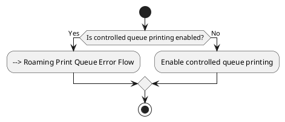
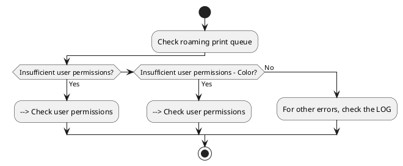
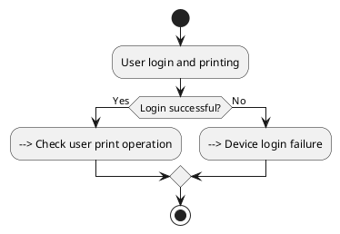
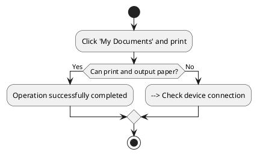
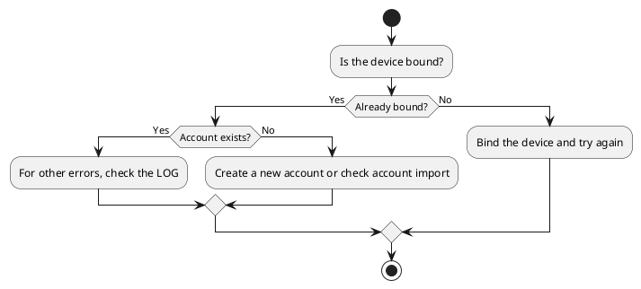
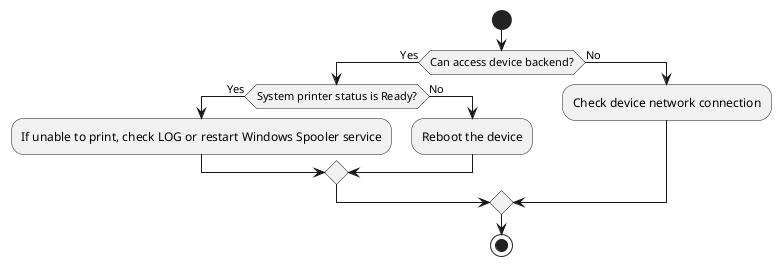

# Print Failure

## Print Document Does Not Appear on the Dashboard
　　
　　Confirm whether the job appears on the print document dashboard after the user submits the print job.
　　

## Is Controlled Queue Printing Enabled
　　
　　Check the roaming print printer settings in [Printer Management & Maintenance].

## Roaming Print Queue Error Flow
　　
　　Check why the roaming print job fails to display in the roaming queue.

## Print Login and Dispatch Flow
　　
    Check why the roaming print job cannot be dispatched to the printer.

## Check User Print Operation

 Check the response of the print job after submitting the print.

## Device Login Failure

 Check the user's device login function.

## Check Device Connection

 Check if the device is online.

