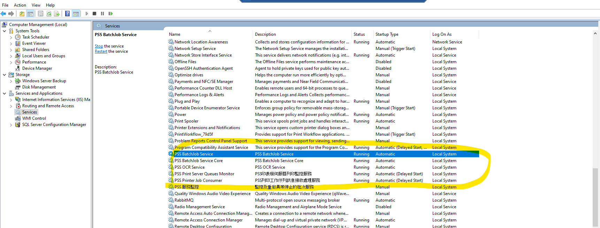

# Related_Services

1\. Check if relevant server services are running normally via WebUI

  #@img_MNG0001/image153.png

2\. Check in Server Services

{width="5.768055555555556in" height="2.2006944444444443in"}

+---------------------------------+------------------------------+
| Service name                    | Description                  |
+=================================+==============================+
| PSS BatchJob Service            | Print document image backup batch service |
+---------------------------------+------------------------------+
| PSS BatchJob Service Core       | System core batch service         |
+---------------------------------+------------------------------+
| PSS OCR Service                 | OCR service                      |
+---------------------------------+------------------------------+
| PSS Print Server Queues Monitor | Print monitoring operation service             |
|                                 |                              |
| PSS Print Job Consumer          |                              |
+---------------------------------+------------------------------+

3\. Check in Server IIS

  #@img_MNG0001/image155.png

  Application Pool name   Description
  ----------------------- -------------------------------------
  PSSAppPool              App Pools of MFP Web Service
  WebAIPMVCAppPool        App Pool of MFP AIP Service Interface
  WebMonitorMVCAppPool    App Pool of Print Queue API Service Interface
  WebOxpdMVCAppPool       App Pool of MFP Oxpd Service Interface
  WebUIAppPool            App Pool of Web Management Interface
