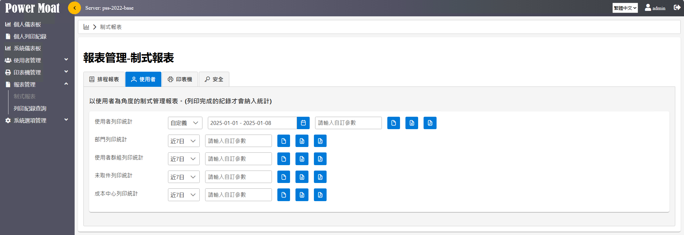
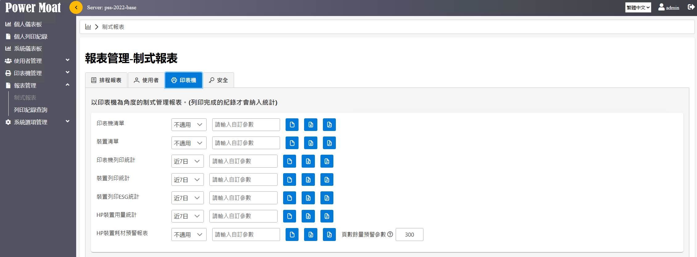
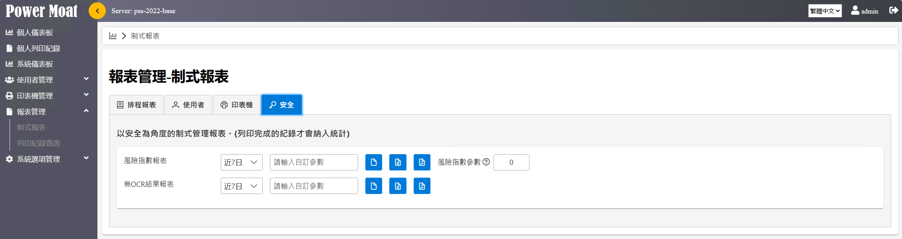

# Standard Reports

PowerMoat provides a variety of standardized reports covering various aspects such as users, printers, and security. The export format supports CSV, EXCEL, and PDF.

{width="5.768055555555556in" height="1.979861111111111in"}

{width="5.768055555555556in" height="2.1284722222222223in"}

{width="5.768055555555556in" height="1.5319444444444446in"}

## List of Standard Reports and Simple Description

| Category | Report Name | Description |
|---|---|---|
| User | User Print Statistics | View the usage status of each user |
| | Department Print Statistics | Analyze print usage by department |
| | User Group Print Statistics | Statistics on usage by user groups |
| | Uncollected Print Statistics | Show usage status of printed but uncollected jobs |
| | Cost Center Print Statistics | Statistics on print usage by cost center |
| Printer | Printer List | List information of all printers configured in the system |
| | Device List | List information of all devices and settings in the system |
| | Printer Print Statistics | Statistics on printer usage |
| | Device Print Statistics | Statistics on device usage |
| | Device Print ESG Statistics | Statistics on device ESG usage |
| | HP Device Usage Statistics | Statistics on device usage using HP usage pages |
| | HP Device Consumable Alert Report | Device consumable usage status using HP consumable pages |
| Security | Risk Index Report | Analyze risk index of documents |
| | No OCR Result Report | List document records that failed OCR successfully |
